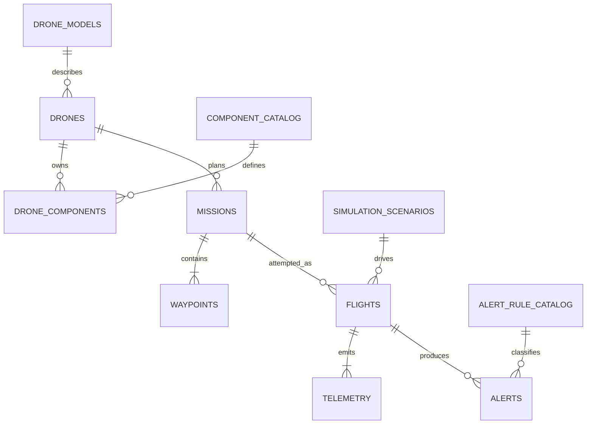

# Relationships

- A route or weather alert can belong to a mission before any flight exists.
- A telemetry alert may optionally point to the affected installed component.
- One mission may be retried, so it can own multiple flights.
- Only one active flight per drone should be enforced transactionally by the backend.
